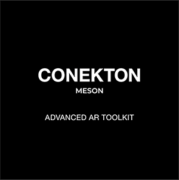
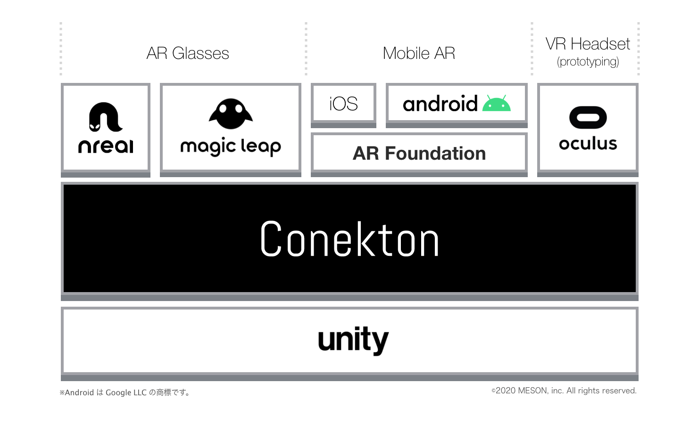
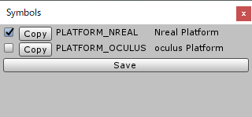

<div align="center">

</div>


[English version here](./en/)


## Introduction

Conektonは**マルチプラットフォーム**、かつ**マルチユーザ**機能を持つARプロダクトを効率的にすばやく開発するために作成されたUnityライブラリです。

Conektonは[Extenject](https://github.com/svermeulen/Extenject)をベースに作成されています。Extenjectをベースに各プラットフォームの機能をインストールすることでマルチプラットフォームを実現しており、使用者は実装したいプラットフォームのSDKを入れるだけですぐに使えるようになっています。


### Conektonの開発背景

Conektonは数多くのARプロダクトを開発するスタートアップ「MESON」が、社内でのARコンテンツの開発をより効率的に行うことを目的に開発したライブラリです。
MESONでは、iOS ARKitを用いたモバイルARコンテンツから、Nreal Light、Magic Leap 1を利用したARグラスコンテンツなどこれまでさまざまなARコンテンツの制作を行ってきました。

それらの制作の過程で、モバイルARとARグラスの相互運用、および各ARグラスプラットフォーム向けの相互運用も非常に重要なタスクであることに気づきました。
AR体験の重要な要素として同じAR空間を複数人でシェアする「マルチユーザ」の重要性もさらに増してきています。
またARコンテンツ制作におけるプロトタイピングの重要性も認識しており、これらコンテンツ制作における効率的な開発の土台が必要となりました。

そこで開発されたのがこのConektonです。
Conektonでは後述するように、複数のARプラットフォームに対応し、また同時にプロトタイピングを目的としてVR（Oculus）プラットフォームにも対応しています。
Conektonを使用することでARコンテンツのプロトタイピングからプロダクト開発までを迅速に行うことを可能にします。


### Conektonのアーキテクチャ

アーキテクチャは以下の図の通りです。



### Conektonの対応プラットフォーム
- Nreal Light
- Magicleap 1
- AR Foundation
- Oculus Quest


## Features

Conektonの主な特徴はクロスプラットフォームとマルチユーザ機能をARコンテンツに素早く実装できる点です。
上記図の通り、主要なARグラスプラットフォームに対応し、またARFoundationにも対応することでモバイルARにも対応しています。

上記に加えて、Oculusプラットフォームにも対応しているのがやや特殊に映るかもしれません。
しかしVRはARを手早く開発するためのツールとして、つまりプロトタイピングの場として適切だと考えており、そのため対応プラットフォームに含まれています。

Conekton使用者はVR上でコンテンツを制作し、手頃なVR HMD（主にOculus Quest）を使用してAR体験をプロトタイピングすることが可能です。

各プラットフォームのスイッチングも、プラットフォーム切り替えを行うだけで完了します。


## Notice

Conektonをご使用頂く前にご確認ください。

### Code of Conductについて

詳細については[こちら](./jp/code_of_conduct.md)


## Installation

### パッケージのインポート

[リリース](https://github.com/MESON-inc/Conekton/releases)タブから最新版の`.unitypackage`をダウンロードし、インポートします。


### プラットフォームの選択

Conektonは前述の通り、複数のプラットフォームに対応しています。
開発を行いたいプラットフォームに「Switch Platform」してご利用ください。


### Nreal / Oculusのスイッチ

Conektonでは`Nreal`と`Oculus`双方に対応しています。どちらもAndroidプラットフォームのため、どちらのプラットフォーム向けなのかを識別するために**Scripting Define Symbols**に値を設定することで実現しています。

この**Symbols**については付属のツールより簡単にスイッチすることができるようになっています。
上部メニューの`Tools > ARUtility > Symbols`よりEditorウィンドウを開き、開発したいプラットフォームのチェックを入れることで**Symbols**を編集することができます。

<div align="center">
<br />
</div>

上記メニューより下記ウィンドウが開くので、適宜必要なプラットフォームのチェックを入れて設定してください。

<div align="center">
<br />
Nreal向けの例
</div>


### Extenjectのインポート

前述の通り、ConektonはExtenjectを利用して構築されているため、別途Extenjectをインポートする必要があります。
Extenjectについては[こちらから最新バージョン](https://github.com/svermeulen/Extenject)をインポートしてください。（開発時点での[使用バージョンは9.1.0](https://github.com/svermeulen/Extenject/releases/tag/v9.1.0)です）


### Photonのインポート

Conektonのマルチユーザのデフォルトの仕組みでは[Photon](https://assetstore.unity.com/packages/tools/network/pun-2-free-119922)を利用しています。
しかし任意のネットワーク・インフラを利用することができるように設計されているため、独自のネットワーク・インフラに置き換えて利用することもできるようになっています。

すぐにでも動作を確認したい場合は前述の[Photon](https://assetstore.unity.com/packages/tools/network/pun-2-free-119922) SDKをインポートしてください。

他のネットワーク・インフラによる拡張については後日ドキュメントを公開します。

### 各種SDKのインポート

開発対象のプラットフォームに応じて適切なSDKをインポートしてください。  
なおNRSDKについては`1.3.0`を、Magic Leapについては`0.24.0`での動作を確認しています。


## Getting started

Conektonでは様々な機能が提供されています。前述のように、ConektonはExtenjectをベースに開発されているためExtenjectの作法に則ってご利用ください。

以下に、主要なふたつの機能について紹介します。
詳細については後述するリンクよりご確認ください。


### IPlayer

namespace: `Conekton.ARUtility.Player.Domain`

`IPlayer`はARカメラ周りを抽象化したインターフェースです。主にカメラの位置や回転、カメラ自身へのアクセスを提供します。

```c#
public interface IPlayer
{
    Transform Root { get; }
    GameObject CameraRig { get; }
    Camera MainCamera { get; }
    Vector3 Position { get; }
    Vector3 Forward { get; }
    Quaternion Rotation { get; }
    Pose GetHumanPose(HumanPoseType type);
    Pose GetHumanLocalPose(HumanPoseType type);
    bool IsActiveHumanPose(HumanPoseType type);
}
```

e.g.) カメラの前方30cmの位置にオブジェクトを配置する。

```c#
[Inject] private IPlayer _player = null;

// ------------------

// カメラの前方30cmの位置にオブジェクトを表示
Vector3 pos = _player.Position + _player.Forward * 0.3f;
_obj.transform.position = pos;
```


### IInputController

namespace: `Conekton.ARUtility.Input.Domain`

`IInputContoroller`は各プラットフォームのコントローラからの入力を抽象化します。現在定義されているインターフェースは以下です。

```c#
public interface IInputController
{
    bool IsTriggerDown { get; }
    bool IsTriggerUp { get; }
    bool IsTouch { get; }
    bool IsTouchDown { get; }
    bool IsTouchUp { get; }
    Vector3 Position { get; }
    Vector3 Forward { get; }
    Quaternion Rotation { get; }
    Vector2 Touch { get; }
    void TriggerHapticVibration(HapticData data);
}
```

e.g.) コントローラの向いている方向にレイを飛ばす

```c#
[Inject] private IInputController _inputController = null;

// ----------------------

private Ray GetRay()
{
    return new Ray(_inputController.Position, _inputController.Forward);
}
```


### 詳細

その他の機能や詳細な使い方に関する情報は[こちら](./jp/GettingStarted.md)からご確認ください。


## Help

Conektonに関する質問やディスカッションについては[こちらのSlack招待リンク](https://join.slack.com/t/conekton/shared_invite/zt-eg7c7eur-OfjrkZ2zHHVUoOX_8HKzpg)よりSlackに参加ください。


## Author Info

Conektonは[MESON, inc](http://meson.tokyo/)によって運用・管理されています。

- Site: http://meson.tokyo/ (Japanese)
- Site: http://meson.tokyo/en/ (English)
- Twitter: https://twitter.com/MESON_TOKYO


## License

このライブラリはApache License 2.0ライセンスの下にあります。
