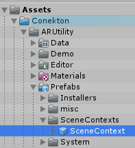
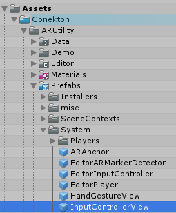
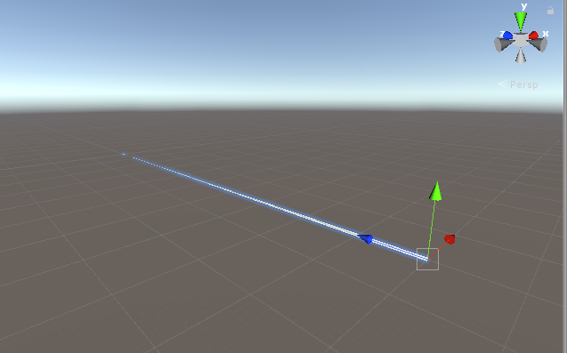
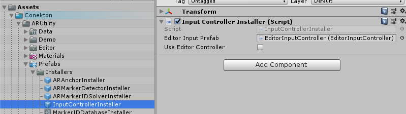
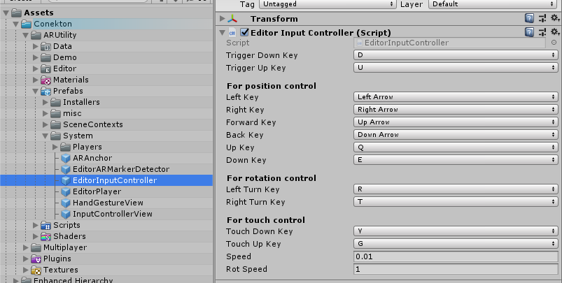

# Getting Started for AR Utility

The following features are enabled by using Extenject installer properly. Please set up settings of Extenject installers as mentioned at each section.


## IPlayer

namespace: `Conekton.ARUtility.Player.Domain`

`IPlayer` is an Interface that allows you to access to the AR camera. 
It gives you access to position and rotation of the camera as well as reference to the camera.

```c#
public interface IPlayer
{
    Transform Root { get; }
    GameObject CameraRig { get; }
    Camera MainCamera { get; }
    Vector3 Position { get; }
    Vector3 Forward { get; }
    Quaternion Rotation { get; }
    Pose GetHumanPose(HumanPoseType type);
    Pose GetHumanLocalPose(HumanPoseType type);
    bool IsActiveHumanPose(HumanPoseType type);
}
```

e.g.) Set an object located at 30 cm away from the camera.

```c#
[Inject] private IPlayer _player = null;

// ------------------

// Set an object located at 30 cm away from the camera.
Vector3 pos = _player.Position + _player.Forward * 0.3f;
_obj.transform.position = pos;
```


### Installer

Use `PlayerInstaller` for the `IPlayer` functionality.


## IInputController

namespace: `Conekton.ARUtility.Input.Domain`

`IInputContoroller` is an Interface that gets inputs from a controller. 
The setting of the predefined Interface is below.

```c#
public interface IInputController
{
    bool IsTriggerDown { get; }
    bool IsTriggerUp { get; }
    bool IsTouch { get; }
    bool IsTouchDown { get; }
    bool IsTouchUp { get; }
    Vector3 Position { get; }
    Vector3 Forward { get; }
    Quaternion Rotation { get; }
    Vector2 Touch { get; }
    void TriggerHapticVibration(HapticData data);
}
```

e.g.) Create the ray that the controller will be casting.

```c#
[Inject] private IInputController _inputController = null;

// ----------------------

private Ray GetRay()
{
    return new Ray(_inputController.Position, _inputController.Forward);
}
```


### Installer

Use `InputControllerInstaller` for the `IInputController` functionality. 


## SceneContextのセットアップ

Because Conekton is built on Extenject, you have to set upSceneContext properly. Conekton offers a ready-to-use SceneContextPrefab, which can be integrated in your project easily. Check the provided demo scene at `Assets/Conekton/ARUtility/Prefabs/SceneContexts/SceneContext`.
By adding the prefab in the scene, Extenject embeds DI into your desired classes. 

<div align="center">
<br />
</div>


### コントローラのレイを視覚化する

You can visualize a controller. Conekton provides a functionality to visualize a controller just by adding `InputControllerView` to the scene, which can be found in at the default project. 
Please make sure you successfully set up `SceneContext`.

<div align="center">
<br /><br />

</div>


### EditorInputControllerを利用してデバッグする

To make it easy to debug your app, Conekton offers a functionality to edit `InputController` using the Unity Editor with keyboard.

Give a check on `Use Editor Controller` in `InputControllerInstaller` to install the Input Controller for Conekton, which can be used in the Unity Editor.  
You don't need to turn `Use Editor Controller` on and off every time you build your app because Conekton properly chooses the Input Controller for the target platform.

<div align="center">
<br />
Use Editor Controller
</div>


Please check the prefab to see more details.

<div align="center">
<br />
You can change some key assigning.
</div>


