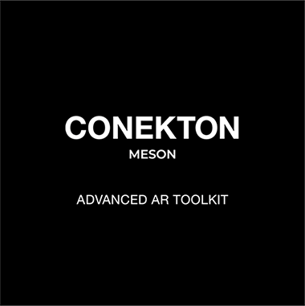
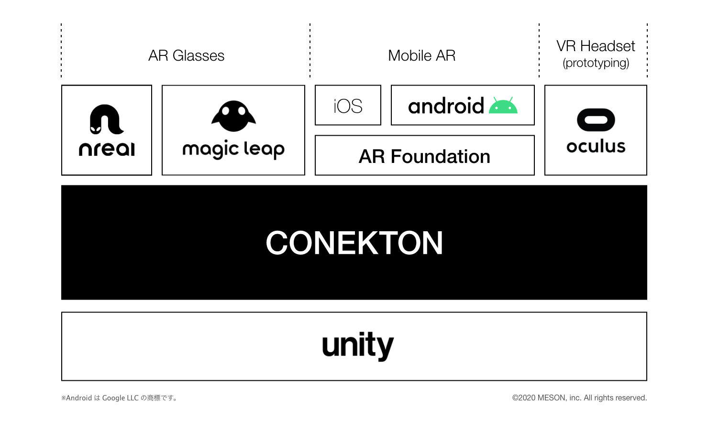
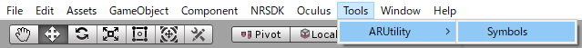
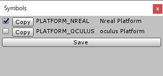

<div align="center">

</div>


## Introduction

Conekton is a Unity library specialized for multi-platform, multi-user AR app development in an efficient and productive way. 

Conekton is built on Extenject, a fork of Zenject. Using Extenject as its framework to store development platforms, Conekton offers the multi-platform functionality, which allows developers to switch target platforms just by installing SDKs.


### Birth of Conekton

Conekton is originally an internal library of MESON, a Tokyo-based AR studio. Since its beginning, MESON has developed various types of AR apps, not just for mobile phones but also for AR HMDs, such as Nreal Light and Magic Leap 1. 

While developing AR apps on various platforms, we noticed the importance of having a cross-platform system of AR development for both mobile AR apps and AR HMD apps. Likewise, we recognize the increasing demand for multiuser functionality as an essential component of AR experiences and the urgent necessity of an efficient and productive development environment for rapid prototyping.

Conekton is born out of these recent trends in the AR industry. Conekton bridges various AR platforms and offers a functionality of quick implementation of multi-user AR experiences. Also, it is designed to be used on VR platforms for prototyping AR apps in VR. Conekton enables you to test your prototypes and develop your AR apps quickly and efficiently.


### Conekton Architecture



### Supported platforms
- Nreal Light
- Magicleap 1
- AR Foundation
- Oculus Quest


## Features

Conekton's major feature is quick implementation of cross-platform functionality and multi-user functionality in your AR apps. These functionalities are deployed in major platforms of ARHMDs as well as mobile AR platforms via ARFoundation.

You may feel curious about why Conekton supports the Oculus platform. By taking advantage of our support for VR, developers are able to test AR prototypes in a VR environment, which contributes to quick and efficient cycles of AR app development.

Using Conekton, developers are able to test an AR experience with VR HMDs, such as Oculus Quest.

What developers need to do is only switch target platforms.


## Notice
Please make sure to read the following.

### Code of Conduct

[Click here](./code_of_conduct.md) to check our Code of Conduct.

### About Conekton Beta

Currently (2020/05), the beta version of Conekton is only offered. Therefore, we limit the number of people who are allowed to modify and fix the Conekton system. We will start the full operation of Conekton as OSS as soon as we are ready to offer. We don't restrict the use of Conekton as long as the license covers its usage.


## Installation

### Import the unity package

Download and install the latest version of .unitypackage from the [Release tab](https://github.com/MESON-inc/Conekton/releases).


### Choose a Target Platform

Because Conekton supports multiple platforms, choose a platform in the "Switch Platform" and click on the Switch Platform button and choose a platform for which you intend building.


### Switch Nreal / Oculus Platforms

Conekton support the Android platforms both for Nreal Light and Oculus. To identify a type of the Android platform, set the value in Scripting Define Symbols.

The Symbols are designed to be changed quickly with a tool prepared in Conekton. To change the Symbols, open an Editor window from Tools > ARUtility > Symbols and put a check on the platform you use.

<div align="center">
<br />
</div>

<div align="center">
<br />
Nreal向けの例
</div>


### Import Extenject

Because Conekton is built on Extenject, you need to import Extenject in advance. 
Import the latest version of Extenject from [here](https://github.com/svermeulen/Extenject). [The current version we use is 9.1.0](https://github.com/svermeulen/Extenject/releases/tag/v9.1.0).


### Import Photon

As default, Conekton uses [Photon](https://assetstore.unity.com/packages/tools/network/pun-2-free-119922) for the implementation of multi-user functionality. If you want to test Conekton as default or with Photon, import the Photon SDK from here. 
Also, you can change the setting and use a network infrastructure you prefer.

We will release a document about details about switching network infrastructures in Conekton as soon as it is ready.


## Getting started

Conekton offers a variety of functions. 
To get started, follow the methods of Extenject and use it properly.

The following is the introduction of two major functions of Conekton.
Please refer to details from the links below.


### IPlayer

namespace: `Conekton.ARUtility.Player.Domain`

`IPlayer` is an Interface that allows you to access to the AR camera. 
It gives you access to position and rotation of the camera as well as reference to the camera.

```c#
public interface IPlayer
{
    Transform Root { get; }
    GameObject CameraRig { get; }
    Camera MainCamera { get; }
    Vector3 Position { get; }
    Vector3 Forward { get; }
    Quaternion Rotation { get; }
    Pose GetHumanPose(HumanPoseType type);
    Pose GetHumanLocalPose(HumanPoseType type);
    bool IsActiveHumanPose(HumanPoseType type);
}
```

e.g.) Set an object located at 30 cm away from the camera.

```c#
[Inject] private IPlayer _player = null;

// ------------------

// Set an object located at 30 cm away from the camera.
Vector3 pos = _player.Position + _player.Forward * 0.3f;
_obj.transform.position = pos;
```


### IInputController

namespace: `Conekton.ARUtility.Input.Domain`

`IInputContoroller` is an Interface that get inputs from a controller. 
The setting of the predefined Interface is below.

```c#
public interface IInputController
{
    bool IsTriggerDown { get; }
    bool IsTriggerUp { get; }
    bool IsTouch { get; }
    bool IsTouchDown { get; }
    bool IsTouchUp { get; }
    Vector3 Position { get; }
    Vector3 Forward { get; }
    Quaternion Rotation { get; }
    Vector2 Touch { get; }
    void TriggerHapticVibration(HapticData data);
}
```

e.g.) Create the ray that the controller will be casting.

```c#
[Inject] private IInputController _inputController = null;

// ----------------------

private Ray GetRay()
{
    return new Ray(_inputController.Position, _inputController.Forward);
}
```


### More Info

[Click here](./GettingStarted.md) to check more details about other functions and methods.


## Help

[Join our Conekton slack community](https://join.slack.com/t/conekton/shared_invite/zt-eg7c7eur-OfjrkZ2zHHVUoOX_8HKzpg) to ask questions and have discussions.


## Author Info

Conekton is managed by [MESON, inc](http://meson.tokyo/).

- Site: http://meson.tokyo/ (Japanese)
- Site: http://meson.tokyo/en/ (English)
- Twitter: https://twitter.com/MESON_TOKYO


## License

This library is licensed under Apache License 2.0.
