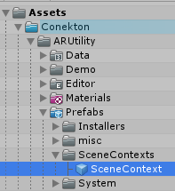
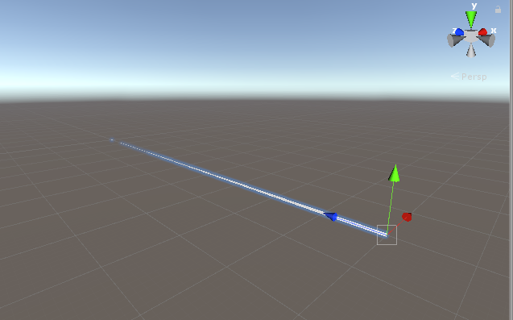

# Getting Started for AR Utility

以下で説明する機能たちはExtenjectのインストーラを適切に設定することで利用可能になります。
各説明に併記されているインストーラを利用ください。

各インストーラはすべて**Prefab**になっています。

## IPlayer

namespace: `Conekton.ARUtility.Player.Domain`

`IPlayer`はARカメラ周りを抽象化したインターフェースです。主にカメラの位置や回転、カメラ自身へのアクセスを提供します。

```c#
public interface IPlayer
{
    Transform Root { get; }
    GameObject CameraRig { get; }
    Camera MainCamera { get; }
    Vector3 Position { get; }
    Vector3 Forward { get; }
    Quaternion Rotation { get; }
    Pose GetHumanPose(HumanPoseType type);
    Pose GetHumanLocalPose(HumanPoseType type);
    bool IsActiveHumanPose(HumanPoseType type);
}
```

e.g.) カメラの前方30cmの位置にオブジェクトを配置する。

```c#
[Inject] private IPlayer _player = null;

// ------------------

// カメラの前方30cmの位置にオブジェクトを表示
Vector3 pos = _player.Position + _player.Forward * 0.3f;
_obj.transform.position = pos;
```


### Installer

`IPlayer`機能を利用するためには`PlayerInstaller`を利用ください。


## IInputController

namespace: `Conekton.ARUtility.Input.Domain`

`IInputContoroller`は各プラットフォームのコントローラからの入力を抽象化します。現在定義されているインターフェースは以下です。

```c#
public interface IInputController
{
    bool IsTriggerDown { get; }
    bool IsTriggerUp { get; }
    bool IsTouch { get; }
    bool IsTouchDown { get; }
    bool IsTouchUp { get; }
    Vector3 Position { get; }
    Vector3 Forward { get; }
    Quaternion Rotation { get; }
    Vector2 Touch { get; }
    void TriggerHapticVibration(HapticData data);
}
```

e.g.) コントローラの向いている方向にレイを飛ばす

```c#
[Inject] private IInputController _inputController = null;

// ----------------------

private Ray GetRay()
{
    return new Ray(_inputController.Position, _inputController.Forward);
}
```


### Installer

`IInputController`機能を利用するためには`InputControllerInstaller`を利用ください。


## SceneContextのセットアップ

ConektonではExtenjectを利用しているため適切に`SceneContext`を設定する必要があります。

基本的にはデモ用のシーンを参照していただくと使い方が分かると思いますが、Projectにすぐに組み込めるように、セットアップ済みの`SceneContext`のPrefabがあるのでそれを利用してセットアップすることができます。

<div align="center">
<br />
</div>
該当のPrefabは「`Assets/Conekton/ARUtility/Prefabs/SceneContexts/SceneContext`」にあります。
このPrefabをシーン内に配置することで、適切にExtenjectがDIしてくれるようになります。


### コントローラのレイを視覚化する

コントローラを視覚化したいことはよくあると思います。Conektonでは視覚化用に`InputControllerView`というPrefabが提供されています。これをシーン内に配置するだけで簡単に視覚化することができるようになっています。

前述の`SceneContext`がセットアップ済みなことが前提です。

<div align="center">
<br /><br />
<br />
シーンに配置した状態
</div>


### EditorInputControllerを利用してデバッグする

Conektonではデバッグを容易にするために、キーボードを利用してUnity Editor上で`InputController`を操作することができるようになっています。

`InputControllerInstaller`のインスペクタに表示されている`Use Editor Controller`のチェックをオンにすることで、Unity Editor上限定で、専用のInput Controllerがインストールされます。（チェックをオンの状態でビルドしても適切に対象プラットフォームのInput Controllerになるためビルドのたびにオン・オフする必要はありません）

<div align="center">
<br />
Use Editor Controllerのチェック
</div>

細かな設定は該当のPrefabを参照ください。

<div align="center">
<br />
キーアサインを調整することができる
</div>

